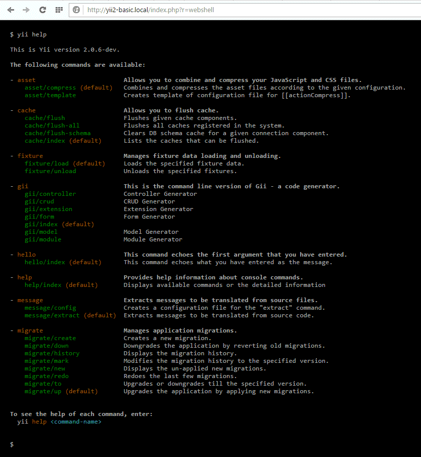

Yii 2.0 web shell
=================

Web shell allows to run `yii` console commands using a browser.



Installation
------------

The preferred way to install this extension is through [composer](http://getcomposer.org/download/).

Either run

```
php composer.phar require --prefer-dist samdark/yii2-webshell "~1.0"
```

or add

```
"samdark/yii2-webshell": "~1.0"
```

to the require section of your `composer.json` file.


Configuration
-------------

To use web shell, include it as a module in the application configuration like the following:
 
```php
return [
    'modules' => [
        'webshell' => [
            'class' => 'samdark\webshell\Module',
            // 'yiiScript' => Yii::getAlias('@root'). '/yii', // adjust path to point to your ./yii script
        ],
    ],

    // ... other application configuration
]
```

With the above configuration, you will be able to access web shell in your browser using
the URL `http://localhost/path/to/index.php?r=webshell`

Access control
--------------

By default access is restricted to local IPs. It could be changed via `allowedIPs` property. Additionally,
`checkAccessCallback` is available to be able to introduce custom access control:

```php
return [
    'modules' => [
        'webshell' => [
            'class' => 'samdark\webshell\Module',
            // 'yiiScript' => Yii::getAlias('@root'). '/yii', // adjust path to point to your ./yii script
            'allowedIPs' => ['127.0.0.1', '::1', '192.168.0.2'],
            'checkAccessCallback' => function (\yii\base\Action $action) {
                // return true if access is granted or false otherwise
                return true;
            }
        ],
    ],

    // ... other application configuration
]
```

Limitations
-----------

Web shell is unable to work interactively because of request-response nature of web. Therefore you should disable interactive mode for commands.
